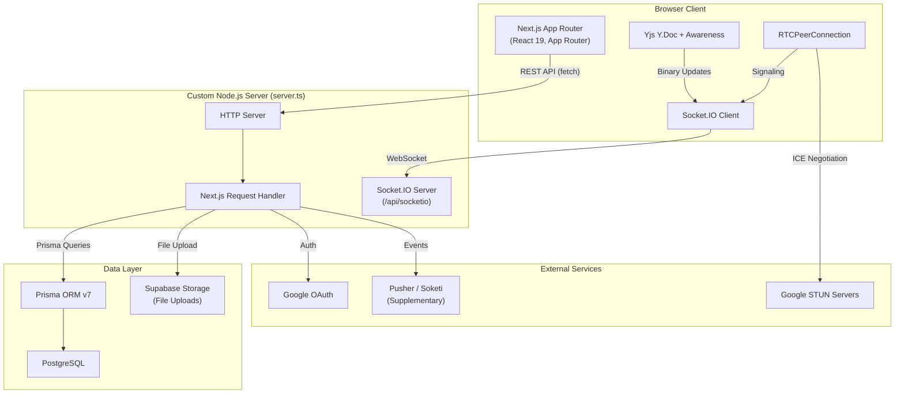
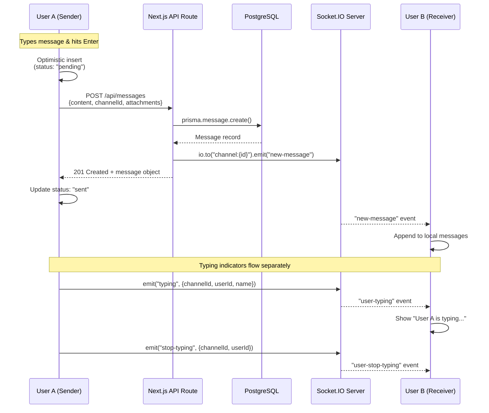
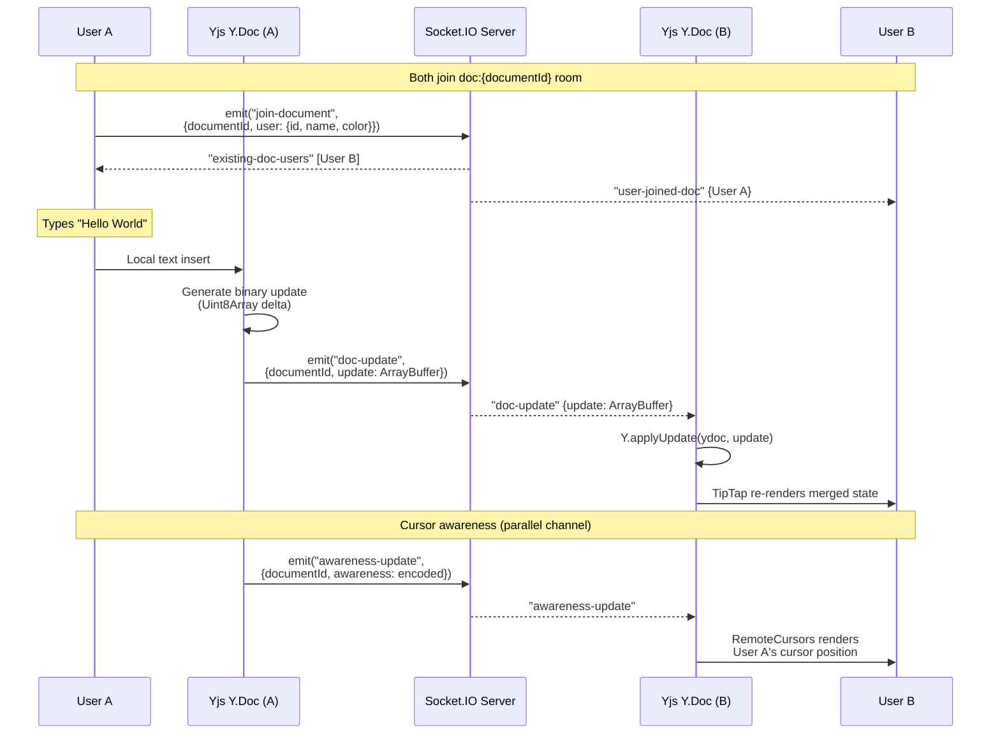
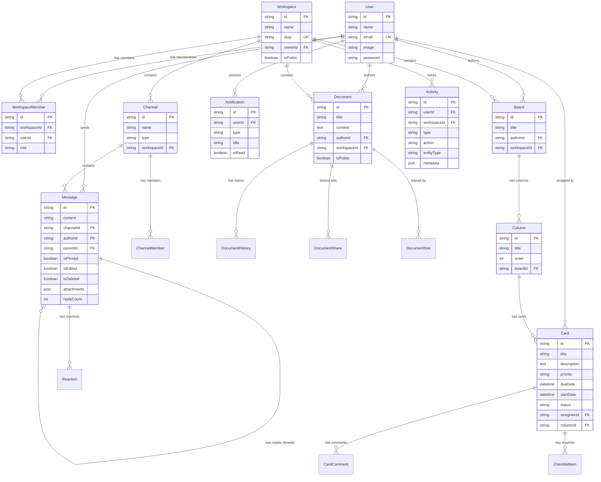
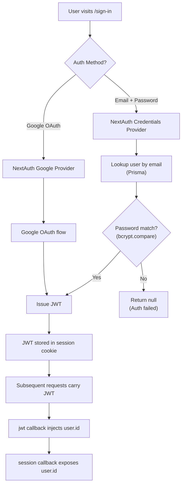
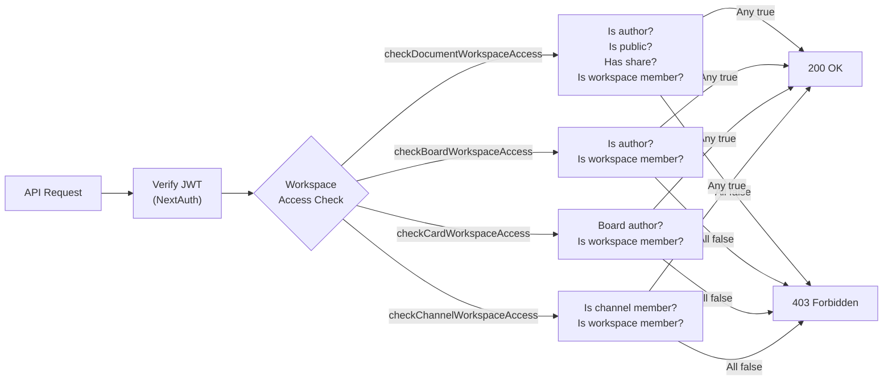
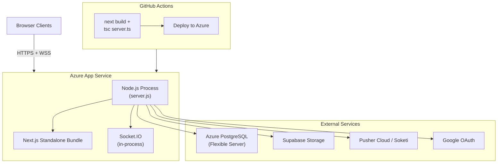

# CollabFlow — Architecture Document

> A deep dive into how CollabFlow works under the hood.

---

## Table of Contents

- [1. System Overview](#1-system-overview)
- [2. Tech Stack Matrix](#2-tech-stack-matrix)
- [3. Core Architecture Flows](#3-core-architecture-flows)
  - [3.1 Real-Time Chat Sync Flow](#31-real-time-chat-sync-flow)
  - [3.2 Document Collaboration (CRDT) Flow](#32-document-collaboration-crdt-flow)
  - [3.3 WebRTC Signaling Flow](#33-webrtc-signaling-flow)
- [4. Database Schema Overview](#4-database-schema-overview)
- [5. Security & Authentication](#5-security--authentication)
- [6. Deployment Architecture](#6-deployment-architecture)

---

## 1. System Overview

CollabFlow is a real-time collaboration platform built as a **Next.js 16** application with a **custom Node.js HTTP server** (`server.ts`). The custom server is necessary because Next.js's built-in server does not support long-lived WebSocket connections — a requirement for Socket.IO, which powers all real-time features (chat, document editing, kanban sync, and video call signaling).



**Why a custom `server.ts`?**

1. **WebSocket Lifecycle**: Socket.IO requires a persistent HTTP server to perform the WebSocket upgrade handshake. Next.js's default server doesn't expose the underlying `http.Server` instance, making it impossible to attach Socket.IO directly.
2. **Global Socket Instance**: The `io` instance is stored on `global.io`, allowing Next.js API routes to emit events to connected clients after persisting data (e.g., broadcasting a new message to a channel room after writing it to PostgreSQL).
3. **Room Management**: The server manages 5 distinct room types (`workspace:`, `channel:`, `doc:`, `board:`, `video:`) with per-room presence tracking and graceful disconnect cleanup.

---

## 2. Tech Stack Matrix

| Layer | Technology | Purpose |
|---|---|---|
| **Framework** | Next.js 16 (App Router) | SSR, file-based routing, API routes |
| **UI Library** | React 19 | Component rendering |
| **Styling** | TailwindCSS v4, Radix UI Primitives | Design system, accessible components |
| **Animations** | Framer Motion | Page transitions, micro-interactions |
| **Icons** | Lucide React | Consistent icon set |
| **Rich Text Editor** | TipTap (StarterKit + 8 extensions) | Document editing with bubble/floating menus |
| **CRDT Engine** | Yjs + y-protocols | Conflict-free collaborative editing |
| **Real-Time Transport** | Socket.IO v4 (custom server) | WebSocket rooms, event broadcasting |
| **Supplementary RT** | Pusher / Soketi | Secondary real-time channel |
| **Video/Audio** | Native WebRTC (`RTCPeerConnection`) | Peer-to-peer media streams |
| **Virtual Background** | MediaPipe SelfieSegmentation | Background blur via canvas processing |
| **Authentication** | NextAuth.js v5 (JWT) | Google OAuth + email/password |
| **ORM** | Prisma v7 (`@prisma/adapter-pg`) | Type-safe database access |
| **Database** | PostgreSQL | Relational data persistence |
| **File Storage** | Supabase Storage | Image/PDF uploads |
| **Drag & Drop** | @dnd-kit/core + @dnd-kit/sortable | Kanban card reordering |
| **Theming** | next-themes | Dark/light/system mode |
| **Deployment** | Azure App Service | Standalone Node.js output |

---

## 3. Core Architecture Flows

### 3.1 Real-Time Chat Sync Flow

Chat follows an **optimistic UI → API persistence → Socket.IO broadcast** pattern. The sender sees instant feedback while the server ensures durability and notifies all other clients.



**Edit/Delete** follow the same pattern — `PUT`/`DELETE` to `/api/messages/[id]` → Socket.IO broadcast → remote clients update in place. Deletes are **soft deletes** (`isDeleted: true`).

**Reactions** are toggled via `POST /api/messages/[id]/reactions` with the same optimistic update + broadcast pattern. The `Reaction` model enforces a unique constraint on `[messageId, userId, emoji]` to prevent duplicates.

---

### 3.2 Document Collaboration (CRDT) Flow

Document collaboration uses **Yjs** (a CRDT library) integrated with **TipTap** (ProseMirror-based editor). Socket.IO acts as the **sync transport** — there is no centralized Yjs server; all clients are equal peers that merge state via CRDT rules.



**Key implementation details:**

- **`useDocumentSync` hook**: Creates a `Y.Doc` instance and a `y-protocols/awareness` instance per document session. Connects to Socket.IO, joins the `doc:{id}` room, and wires up `Y.Doc.on('update')` to emit binary deltas.
- **Awareness sync**: Uses `encodeAwarenessUpdate` / `applyAwarenessUpdate` from `y-protocols` to propagate cursor positions, user names, and colors.
- **TipTap integration**: `@tiptap/extension-collaboration` binds the TipTap editor to the shared `Y.Doc`. `@tiptap/extension-collaboration-cursor` renders remote cursors via Awareness data.
- **Persistence**: Content is periodically saved to PostgreSQL via `PUT /api/documents/[id]` (HTML export from TipTap). The Yjs state is authoritative during a session; the database stores the latest HTML snapshot for loading.

---

### 3.3 WebRTC Signaling Flow

Video/audio calls use **native WebRTC** (`RTCPeerConnection`) with Socket.IO as the **signaling server**. The actual media streams flow peer-to-peer — the server only facilitates the initial handshake.

```mermaid
sequenceDiagram
    participant A as User A (Initiator)
    participant SIO as Socket.IO Server
    participant B as User B (Joiner)
    participant STUN as STUN/TURN Server

    Note over A: Creates room, joins video:{roomId}
    A->>SIO: emit("join-room",<br/>{roomId, userId, userName, userImage})
    SIO-->>A: "existing-users" [ ]

    Note over B: Joins the same room
    B->>SIO: emit("join-room",<br/>{roomId, userId, userName, userImage})
    SIO-->>B: "existing-users" [{socketId: A, ...}]
    SIO-->>A: "user-joined-room" {socketId: B, ...}

    Note over B: Creates PeerConnection for User A
    B->>STUN: Gather ICE candidates
    STUN-->>B: ICE candidates

    B->>B: createOffer()
    B->>SIO: emit("offer",<br/>{targetSocketId: A, offer: SDP})
    SIO-->>A: "offer" {offer: SDP, fromSocketId: B}

    A->>A: setRemoteDescription(offer)
    A->>A: createAnswer()
    A->>SIO: emit("answer",<br/>{targetSocketId: B, answer: SDP})
    SIO-->>B: "answer" {answer: SDP, fromSocketId: A}

    B->>B: setRemoteDescription(answer)

    Note over A, B: ICE candidate exchange
    A->>SIO: emit("ice-candidate",<br/>{targetSocketId: B, candidate})
    SIO-->>B: "ice-candidate" {candidate, fromSocketId: A}
    B->>SIO: emit("ice-candidate",<br/>{targetSocketId: A, candidate})
    SIO-->>A: "ice-candidate" {candidate, fromSocketId: B}

    Note over A, B: P2P connection established
    A<-->B: Direct media stream (audio/video)

    Note over A, B: ICE restart on connection failure
    A->>SIO: emit("ice-restart",<br/>{targetSocketId: B})
    SIO-->>B: "ice-restart-request"<br/>{fromSocketId: A}
    B->>B: Renegotiate connection
```

**ICE Server Configuration** (from `useVideoCall.ts`):

```typescript
const ICE_SERVERS: RTCIceServer[] = [
    { urls: "stun:stun.l.google.com:19302" },
    { urls: "stun:stun1.l.google.com:19302" },
    { urls: "stun:stun2.l.google.com:19302" },
    { urls: "stun:stun3.l.google.com:19302" },
    // Optional TURN server via environment variables
    ...(process.env.NEXT_PUBLIC_TURN_URL ? [{
        urls: process.env.NEXT_PUBLIC_TURN_URL,
        username: process.env.NEXT_PUBLIC_TURN_USERNAME,
        credential: process.env.NEXT_PUBLIC_TURN_CREDENTIAL,
    }] : []),
];
```

**Additional capabilities:**
- **Connection Quality Monitoring**: `oniceconnectionstatechange` tracks per-peer connection quality (`excellent` / `good` / `fair` / `poor`), displayed via `ConnectionQualityIndicator.tsx`.
- **Virtual Background**: `useVirtualBackground` hook uses **MediaPipe SelfieSegmentation** to segment the person from the background, applies a 10px Gaussian blur to the background, and outputs the processed stream via `canvas.captureStream(30)`.
- **In-Call Chat**: Text messages within the video room are broadcast via Socket.IO's `video-chat-message` event.

---

## 4. Database Schema Overview

The database is modeled around **Workspaces** as the top-level organizational unit. All collaborative resources belong to a workspace.



**Key Design Decisions:**

| Decision | Rationale |
|---|---|
| Soft deletes on messages (`isDeleted` flag) | Preserves thread integrity; deleted messages show as "[message deleted]" |
| `labels` as `String[]` on Card | Avoids a join table for a simple tagging feature; leverages PostgreSQL array type |
| `attachments` as `Json` on Message | Flexible schema for file metadata (`{type, url, name, size}`) without a separate table |
| Single `assigneeId` on Card | Simplicity-first; each card has one assignee rather than a many-to-many relation |
| `DocumentHistory.snapshot` as `Text` | Full HTML content at each history point; enables point-in-time restore |
| Composite unique on `WorkspaceMember[workspaceId, userId]` | Prevents duplicate memberships |
| Composite unique on `Reaction[messageId, userId, emoji]` | One reaction per user per emoji per message |

---

## 5. Security & Authentication

### 5.1 Authentication Strategy



- **Session Strategy**: JWT (stateless) — no server-side session store required.
- **Providers**: Google OAuth + Credentials (email/password with `bcryptjs` hashing).
- **User Provisioning**: `ensureUser.ts` guarantees a `User` record exists in the database for every authenticated session.

### 5.2 Middleware Route Protection

The `middleware.ts` runs on the **Edge Runtime** and enforces two rules:

1. **Authentication Gate**: All routes require a valid session except explicit public routes (`/`, `/sign-in`, `/sign-up`, `/explore`, `/api/auth/*`, `/api/register`).
2. **Security Headers**: Every response includes:

| Header | Value |
|---|---|
| `X-Frame-Options` | `DENY` |
| `X-Content-Type-Options` | `nosniff` |
| `Referrer-Policy` | `strict-origin-when-cross-origin` |
| `Permissions-Policy` | `camera=self, microphone=self, geolocation=()` |
| `Strict-Transport-Security` | `max-age=31536000; includeSubDomains` |

### 5.3 Workspace-Level Access Control

Every resource access is gated by workspace membership. The `workspaceAccess.ts` module provides four guard functions that are called inside API routes:



### 5.4 API Rate Limiting

An **in-memory sliding window** rate limiter (`rateLimit.ts`) protects API routes against abuse. Expired entries are garbage-collected every 5 minutes.

| Category | Limit | Window |
|---|---|---|
| Read APIs | 120 req | 60 seconds |
| Write APIs (create/update/delete) | 30 req | 60 seconds |
| Authentication | 10 req | 60 seconds |
| File Upload | 10 req | 60 seconds |
| Search | 30 req | 60 seconds |

---

## 6. Deployment Architecture

### 6.1 Target Platform

CollabFlow is deployed to **Azure App Service** as a standalone Node.js application.



### 6.2 Build Pipeline

```bash
# Build steps (from package.json)
next build                    # Generates .next/standalone
npx tsc server.ts \
  --outDir .next/standalone \
  --esModuleInterop \
  --module commonjs \
  --skipLibCheck               # Compiles custom server to JS

# Start command
node .next/standalone/server.js
```

**Key configuration** (`next.config.ts`):
- `output: 'standalone'` — produces a self-contained deployment artifact with all `node_modules` inlined.
- `images.unoptimized: true` — disables Next.js image optimization (not available on Azure App Service without custom configuration).

### 6.3 WebSocket Scaling Challenges

The current architecture runs Socket.IO **in-process** with the Node.js server. This has specific scaling implications:

| Challenge | Impact | Mitigation |
|---|---|---|
| **Single-process Socket.IO** | All WebSocket connections must route to the same process; horizontal scaling breaks room-based broadcasting | Pusher/Soketi is available as a supplementary broadcast channel that works across instances |
| **In-memory rate limiter** | Rate limit state is per-process; not shared across instances | Acceptable for single-instance deployment; would need Redis adapter for multi-instance |
| **Sticky sessions required** | Socket.IO's polling fallback requires consistent routing to the same server | Azure App Service ARR affinity must be enabled |
| **Connection limits** | Azure App Service has per-instance connection limits | `maxHttpBufferSize: 1MB`, `perMessageDeflate: false`, `httpCompression: false` — tuned for lower latency over bandwidth |

For higher scale, the recommended evolution path would be:
1. Add `@socket.io/redis-adapter` to share rooms across processes
2. Use Azure SignalR Service or a dedicated WebSocket gateway
3. Move Yjs sync to a dedicated collaboration server (e.g., Hocuspocus)
